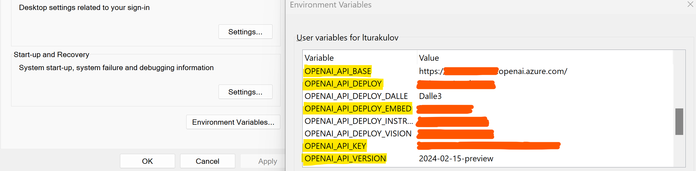

# Retrieval-Augmented Generation (RAG) with LlamaIndex and Azure OpenAI
LlamaIndex is a popular framework for building RAG solutions, thanks to its abstractions of data connectors, indexes and processing engines. You will find a Jupyter notebook in this repo, that utilises LlamaIndex and Azure OpenAI models (GPT-4 and Embedding) to answer queries with pre-indexed local content.
> **Note:** content file used in this demo was borrowed from [Microsoft's Azure OpenAI + Azure AI Search Build solution](https://github.com/Azure-Samples/azure-search-openai-demo)

To build this demo, I used the latest version of LlamaIndex (**v0.10.19** at the time of writing). To upgrade your _llama-index_ Python package, please use the following pip command:
```
pip install --upgrade llama-index
```

## Table of contents:
- [Part 1: Configuring solution environment](https://github.com/LazaUK/AOAI-LlamaIndex-VectorStore#part-1-configuring-solution-environment)
- [Part 2: Indexing and retrieving content](https://github.com/LazaUK/AOAI-LlamaIndex-VectorStore#part-2-indexing-and-retrieving-content)

## Part 1: Configuring solution environment
1. To use Azure OpenAI backend, assign the API endpoint name, version and key, along with the Azure OpenAI deployment name of GPT and Embedding models to **OPENAI_API_BASE**, **OPENAI_API_KEY**, **OPENAI_API_VERSION**, **OPENAI_API_DEPLOY** (for GPT) and **OPENAI_API_DEPLOY_EMBED** (for Embedding) environment variables respectively.

2. Install the required Python packages, by using the **pip** command and the provided requirements.txt file.
```
pip install -r requirements.txt
```

## Part 2: Indexing and retrieving content
1. Instantiate AzureOpenAI class with details of your GPT model (I'm using **GPT-4 Turbo** deployment).
``` Python
llm = AzureOpenAI(
    model = "gpt-4",
    deployment_name = AOAI_DEPLOYMENT1,
    api_key = AOAI_API_KEY,
    azure_endpoint = AOAI_API_BASE,
    api_version = AOAI_API_VERSION,
)
```
2. Instantiate AzureOpenAIEmbedding class with details of your Embedding model (I'm using **text-embedding-ada-002** deployment).
> **Note:** Assumptions are that both of your models are deployed in the same Azure OpenAI resource. If it's not the case, please adjust the values for Azure OpenAI endpoint and its API key.
``` Python
embed_model = AzureOpenAIEmbedding(
    model = "text-embedding-ada-002",
    deployment_name = AOAI_DEPLOYMENT2,
    api_key = AOAI_API_KEY,
    azure_endpoint = AOAI_API_BASE,
    api_version = AOAI_API_VERSION,
)
```
3. Next step is to set our Azure OpenAI deployments as default LLM and Embedding models in LlamaIndex's instance settings.
``` Python
Settings.llm = llm
Settings.embed_model = embed_model
```
4. We can now use SimpleDirectoryReader class to create Document objects from all files in a give directory. In our case, **data** directory contains single markdown file with description of a fictitious company, _Contoso Electronics_.
``` Python
documents = SimpleDirectoryReader(input_dir="data").load_data()
```
5. VectorStoreIndex class can help us to chunk our Document objects, geerate vector embeddings and index them in a vector store.
``` Python
index = VectorStoreIndex.from_documents(documents)
```
6. We can use our vector store as a query engine to retrieve required content and feed it to GPT-4 Turbo model for reasoning, e.g. to check about vacation perks available at Contoso.
``` Python
query_engine = index.as_query_engine()
answer = query_engine.query("What are the vacation perks at Contoso Electronics?")
```
7. If successful, you should get an output similar to this one:
``` JSON
Query: What are the vacation perks at Contoso Electronics?
-----------------
Answer: At Contoso Electronics, the vacation perks are structured into three tiers:

1. Standard Tier: Employees receive 2 weeks of vacation with a health and wellness stipend.
2. Senior Tier: Employees receive 4 weeks of vacation along with travel vouchers for a dream destination.
3. Executive Tier: Employees are granted 6 weeks of vacation and a luxury resort getaway with family.
```
